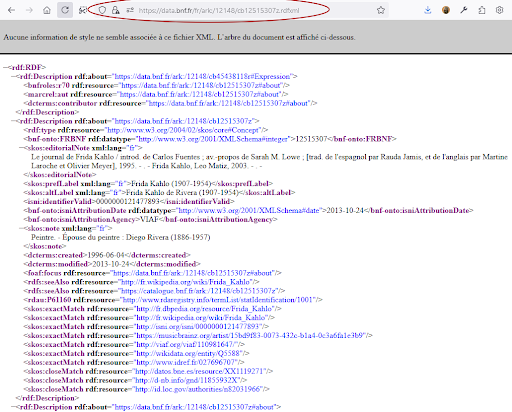
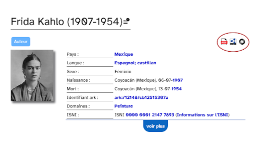

An early adopter of ARKs, the BnF shows good practices for displaying persistent linked open data (LOD) using
ARK suffixes for object variants.

<!--more-->

{: .img-thumbnail .img-responsive fetchpriority="high" height="auto" loading="eager"}

This post introduces [data.bnf.fr](https://data.bnf.fr) (dataBnF), the data gateway service of the French National Library, or Bibliothèque nationale de France (BnF). The main purpose of dataBnF is to promote BnF data discoverability and re-use both within and beyond its catalogs. This article dives into some details of how a national library uses ARK (Archival Resource Key) identifiers to support the Semantic Web’s vision of a “Web of Data”, which is built on Linked Open Data (LOD) for sharing structured (hierarchical), machine-readable information on the web.

In 2024, the [dataBnF](https://data.bnf.fr) website underwent a major usability and graphic redesign to make the interface more readable and to offer more intuitive, operational  features for discovering BnF collections. This project was an opportunity to reexamine how ARK identifiers were implemented and presented on the website, and to leverage [ARK variant form
qualifiers](https://www.ietf.org/archive/id/draft-kunze-ark-40.html#name-arks-that-reveal-object-var) in order to return metadata and inter-resource relationships needed by the Semantic Web. 

## Where we started

One challenge was to take data offered by the BnF in traditional catalogue-entity formats such as INTERMARC (BnF’s version of the [MARC](https://www.loc.gov/marc/) format) and [XML-EAD](https://www.loc.gov/ead/index.html), and to make it available in modern formats such as [RDF](https://en.wikipedia.org/wiki/Resource_Description_Framework) and [JSON](https://en.wikipedia.org/wiki/JSON). These modern formats express a hierarchical entity as a flattened byte stream (serialization) for easy transmission over networks and later reconstruction (deserialization) on the receiving end. The main objectives of [dataBnF](https://data.bnf.fr) were as follows.

1. Aggregate BnF data produced in a variety of formats.
2. Expose them as Linked Open Data ready for Semantic Web applications such as OWL ontologies, SPARQL queries, knowledge graphs, AI-powered tools.
3. Experiment with and create new services, including data visualizations.

A goal of [dataBnF](https://data.bnf.fr) was to facilitate access to BnF resources in their original environment: authority and bibliographic records from the general catalogue, records from the BnF Archives and Manuscripts catalogue, educational resources from the Les Essentiels portal, digitized documents from Gallica, etc.

All of these resources are identified by ARKs whose “[shoulder](https://arks.org/about/ark-namespaces/)” (a kind of internal prefix) varies depending on the source application. A BnF ARK shoulder is a 2- or 3-letter code following the `ark:/12148/` that begins each BnF ARK. A resource from the general catalogue is prefixed by the two characters “cb” (`ark:/12148/cb13913991p`). If the resource is imported from EAD, it is prefixed by “cc” (`ark:/12148/cc56356g`). Gallica resources are prefixed by “btv” or “bpt” (for example, `ark:/12148/bpt6k1911706t` and `ark:/12148/btv1b108674013`).

While many Semantic Web links (URLs, or `https://` URIs) out in the wild are not meant to be “actionable” (they always return a 404 Page Not Found error), in stricter alignment with Linked Open Data principles, [dataBnF](https://data.bnf.fr) ARKs are actionable. As such, all dataBnF ARKs are Semantic Web links that are meant to persist and to resolve.

When we began the [dataBnF](https://data.bnf.fr) project, these ARKs were often overlooked by users. They appeared at the bottom of the page, while the impersistent page URLs that appeared up top in the browser’s location bar tended to get used for citation. This is a common problem for all persistent identifier (PID) types, and our solution was to make sure that the ARK appears in the location bar. This encourages the use of ARKs in citations and in search engine indexes (SEO). 

We also wanted to simplify and rationalize the sometimes confusing mix of ways to access different representations of a resource, such as the  HTML page or RDF serialization. Prior to the project, there were at least three ways:

- For the impersistent page URL, adding a .rdf inflection led to the RDF/XML representation of the resource (the set of triples whose subject or object is the URL).
- The same was true for the ARK URL
- [HTTP content
  negotiation](https://www.rfc-editor.org/rfc/rfc9110.html#name-content-negotiation) allowed a software client to request a given representation using HTTP headers.

## Where we got to

To simplify the user experience and our own maintenance, we added download buttons to help users explicitly request a representation. We also took advantage of the ARK variant qualifier mechanism to support the same thing for software (and human) clients.  Since the website redesign, access to different representations of the resource is provided using the following qualifiers:

- `.rdf` = `.rdfxml` for RDF/XML
- `.rdfnt` for N-triples
- `.rdfn3` for Notation3
- `.rdfjsonld` for JSON-LD
- `.json` for JSON
- `.pdf` for PDF

Here’s an example of very detailed metadata available for RDF/XML, with the ARK showing in the browser location bar at the top, followed by a simpler metadata display with download and export buttons for PDF, JSON, XML, NT, N3, and JSON-LD.

{: .img-thumbnail .img-responsive fetchpriority="high" height="auto" loading="eager"}

Export buttons are located at the top-right of the main metadata frame displayed with the HTML (the "default" variant) in this next screenshot of https://data.bnf.fr/en/ark:/12148/cb12515307z.
 
{: .img-thumbnail .img-responsive fetchpriority="high" height="auto" loading="eager"}

We invite you to visit [dataBnF](https://data.bnf.fr) to see how we have simplified access to all available resource representations, and made the ARK identifier constantly visible to users.

[entry]: ../../assets/images/posts/bnf_entry.png
