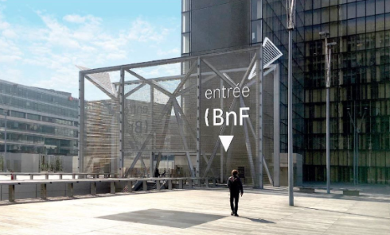

An early adopter of ARKs, the BnF has developed practices for displaying persistent linked open data (LOD) using
ARK suffixes for object variants.

<!--more-->

{: .img-thumbnail .img-responsive fetchpriority="high" height="auto" loading="eager"}

This post introduces [data.bnf.fr](https://data.bnf.fr) (dataBnF), the data gateway service of the French National Library, or Bibliothèque nationale de France (BnF). The main purpose of dataBnF is to promote BnF data discoverability and re-use both within and beyond its catalogs. This article dives into some details of how a national library uses ARK (Archival Resource Key) identifiers to support the Semantic Web’s vision of a “Web of Data”, which is built on Linked Open Data (LOD) for sharing structured (hierarchical), machine-readable information on the web.

In 2024, the [dataBnF](https://data.bnf.fr) website underwent a major usability and graphic redesign to make the interface more readable and to offer more intuitive, operational  features for discovering BnF collections. This project was an opportunity to reexamine how ARK identifiers were implemented and presented on the website, and to leverage [ARK variant form
qualifiers](https://www.ietf.org/archive/id/draft-kunze-ark-40.html#name-arks-that-reveal-object-var) in order to return metadata and inter-resource relationships needed by the Semantic Web. 

## Where we started

One challenge was to take data offered by the BnF in traditional catalogue-entity formats such as INTERMARC (BnF’s version of the [MARC](https://www.loc.gov/marc/) format) and [XML-EAD](https://www.loc.gov/ead/index.html), and to make it available in modern formats such as [RDF](https://en.wikipedia.org/wiki/Resource_Description_Framework) and [JSON](https://en.wikipedia.org/wiki/JSON). These modern formats express a hierarchical entity as a flattened byte stream (serialization) for easy transmission over networks and later reconstruction (deserialization) on the receiving end. The main objectives of [dataBnF](https://data.bnf.fr) were as follows.

1. Aggregate BnF data produced in a variety of formats.
2. Expose them as Linked Open Data ready for Semantic Web applications such as OWL ontologies, SPARQL queries, knowledge graphs, AI-powered tools.
3. Experiment with and create new services, including data visualizations.

A goal of [dataBnF](https://data.bnf.fr) was to facilitate access to BnF resources in their original environment: authority and bibliographic records from the general catalogue, records from the BnF Archives and Manuscripts catalogue, educational resources from the Les Essentiels portal, digitized documents from Gallica, etc.

All of these resources are identified by ARKs whose “[shoulder](https://arks.org/about/ark-namespaces/)” (a kind of internal prefix) varies depending on the source application. A BnF ARK shoulder is a 2- or 3-letter code following the `ark:/12148/` that begins each BnF ARK. A resource from the general catalogue is prefixed by the two characters “cb” (`ark:/12148/cb13913991p`). If the resource is imported from EAD, it is prefixed by “cc” (`ark:/12148/cc56356g`). Gallica resources are prefixed by “btv” or “bpt” (for example, `ark:/12148/bpt6k1911706t` and `ark:/12148/btv1b108674013`).

While many Semantic Web links (URLs, or https:// URIs) out in the wild are not meant to be “actionable” (they always return a 404 Page Not Found error), in stricter alignment with Linked Open Data principles, [dataBnF](https://data.bnf.fr) ARKs are actionable. As such, all dataBnF ARKs are Semantic Web links that are meant to persist and to resolve.

When we began the [dataBnF](https://data.bnf.fr) project, these ARKs were often overlooked by users. They appeared at the bottom of the page, while the impersistent page URLs that appeared up top in the browser’s location bar tended to get used for citation. This is a common problem for all persistent identifier (PID) types. Our solution was to make sure that the ARK appears in the location bar. which encourages the use of ARKs in citations and in search engine indexes (SEO). 

We also wanted to simplify and rationalize the sometimes confusing mix of ways to access different representations of a resource, such as the  HTML page or RDF/XML representation (the set of [semantic triples](https://en.wikipedia.org/wiki/Semantic_triple) whose subject or object is the URL). When we started out,

- adding an `.rdf` suffix to the ARK URL led to the RDF/XML representation,
- adding an `.rdf` suffix to the impersistent page URL did the same thing, and
- using [HTTP content
  negotiation](https://www.rfc-editor.org/rfc/rfc9110.html#name-content-negotiation) via a software client was a third way.

## Where we got to

To simplify the user experience and our own maintenance, we added download buttons to help users explicitly request a representation. We also took advantage of the ARK variant qualifier mechanism to support the same thing for software (and human) clients.  Since the website redesign, access to different representations of the resource is provided using the following qualifiers (suffixes):

- `.rdf` or `.rdfxml` for RDF/XML
- `.rdfnt` for N-triples
- `.rdfn3` for Notation3
- `.rdfjsonld` for JSON-LD
- `.json` for JSON
- `.pdf` for PDF

For example, here's some of the metadata downloaded in RDF/XML upon accessing [https://data.bnf.fr/ark:/12148/cb12515307z.rdfxml]().

```xml
<rdf:Description rdf:about="https://data.bnf.fr/ark:/12148/cb414064167#Expression">
  <bnfroles:r70 rdf:resource="https://data.bnf.fr/ark:/12148/cb12515307z#about"/>
  <marcrel:aut rdf:resource="https://data.bnf.fr/ark:/12148/cb12515307z#about"/>
  <dcterms:contributor rdf:resource="https://data.bnf.fr/ark:/12148/cb12515307z#about"/>
</rdf:Description>
  <rdf:Description rdf:about="https://data.bnf.fr/ark:/12148/cb12515307z">
  <rdf:type rdf:resource="http://www.w3.org/2004/02/skos/core#Concept"/>
  <bnf-onto:FRBNF rdf:datatype="http://www.w3.org/2001/XMLSchema#integer">12515307</bnf-onto:FRBNF>
  <skos:editorialNote xml:lang="fr">Le journal de Frida Kahlo / introd. de Carlos Fuentes ; av.-propos de Sarah M. Lowe ; [trad. de l'espagnol par Rauda Jamis, et de l'anglais par Martine Laroche et Olivier Meyer], 1995. - . - Frida Kahlo, Leo Matiz, 2003. - . -</skos:editorialNote>
  <skos:prefLabel xml:lang="fr">Frida Kahlo (1907-1954)</skos:prefLabel>
  <skos:altLabel xml:lang="fr">Frida Kahlo de Rivera (1907-1954)</skos:altLabel>
  <isni:identifierValid>0000000121477893</isni:identifierValid>
  <bnf-onto:isniAttributionDate rdf:datatype="http://www.w3.org/2001/XMLSchema#date">2013-10-24</bnf-onto:isniAttributionDate>
  <bnf-onto:isniAttributionAgency>VIAF</bnf-onto:isniAttributionAgency>
  <skos:note xml:lang="fr">Peintre. - Épouse du peintre : Diego Rivera (1886-1957)</skos:note>
  <dcterms:created>1996-06-04</dcterms:created>
  <dcterms:modified>2013-10-24</dcterms:modified>
  <foaf:focus rdf:resource="https://data.bnf.fr/ark:/12148/cb12515307z#about"/>
  <rdfs:seeAlso rdf:resource="http://fr.wikipedia.org/wiki/Frida_Kahlo"/>
  <rdfs:seeAlso rdf:resource="https://catalogue.bnf.fr/ark:/12148/cb12515307z"/>
  <rdau:P61160 rdf:resource="http://www.rdaregistry.info/termList/statIdentification/1001"/>
  <skos:exactMatch rdf:resource="http://fr.dbpedia.org/resource/Frida_Kahlo"/>
  <skos:exactMatch rdf:resource="http://fr.wikipedia.org/wiki/Frida_Kahlo"/>
  <skos:exactMatch rdf:resource="http://isni.org/isni/0000000121477893"/>
  <skos:exactMatch rdf:resource="https://musicbrainz.org/artist/15bd9f83-0073-432c-b1a4-0c3a6fa1e3b9"/>
  <skos:exactMatch rdf:resource="http://viaf.org/viaf/110981647/"/>
  <skos:exactMatch rdf:resource="http://wikidata.org/entity/Q5588"/>
  <skos:exactMatch rdf:resource="http://www.idref.fr/027696707"/>
  <skos:closeMatch rdf:resource="http://datos.bne.es/resource/XX1119271"/>
  <skos:closeMatch rdf:resource="http://d-nb.info/gnd/11855932X"/>
  <skos:closeMatch rdf:resource="http://id.loc.gov/authorities/n82031966"/>
</rdf:Description>
```

The "default" variant (no suffix) for [https://data.bnf.fr/ark:/12148/cb12515307z]() returns simple metadata displayed in HTML, as shown below. All the download and export choices (PDF, JSON, XML, NT, N3, and JSON-LD) can be selected from the buttons and drop-down menus circled in red in the upper right-hand corner.
 
{: .img-thumbnail .img-responsive fetchpriority="high" height="auto" loading="eager"}

We invite you to visit [dataBnF](https://data.bnf.fr) to see how the National Library of France provides simple access to all resource representations and makes the ARK identifier constantly visible to users.

[entry]: ../../assets/images/posts/bnf_entry.png
